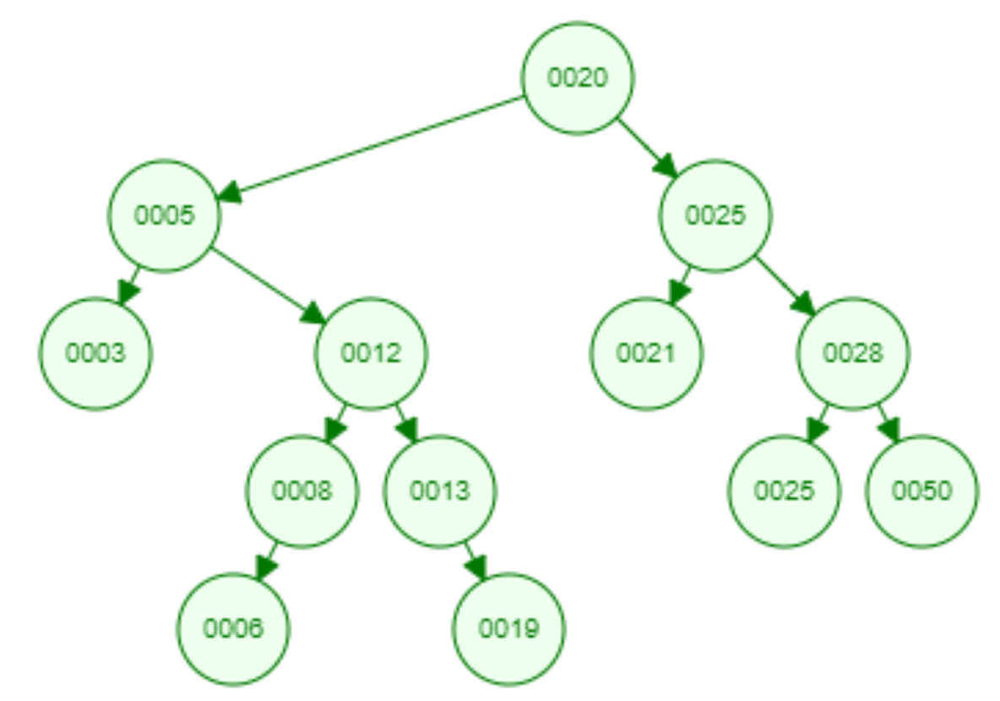

# ALGO TD3 - Arbre binaire de recherche

###### tags: `ESGI`, `ALGO`

## Exercice 1:
####1. 
> Un arbre binaire de recherche est un arbre binaire dans lequel chaque nœud possède une clé,
> telle que chaque nœud du sous-arbre gauche ait une clé inférieure ou égale à celle du nœud considéré,
> et que chaque nœud du sous-arbre droit possède une clé supérieure ou égale à celle-ci.
> Les nœuds que l'on ajoute deviennent des feuilles de l'arbre.

Cette arbre est un arbre binaire de recherche.

####2.
Les noeuds 5 et 25 existent déjà


####3.
Parcours en profondeur infixe : ```3 5 6 8 12 13 20 21 25 28```. On remarque que lors d'un parcours en profondeur infixe le résultat obtenu est un tableau trié par ordre croissant


