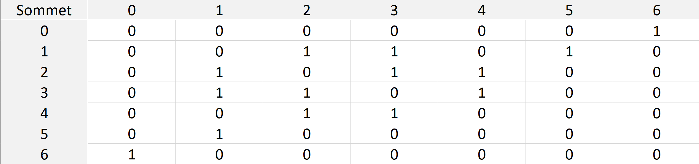
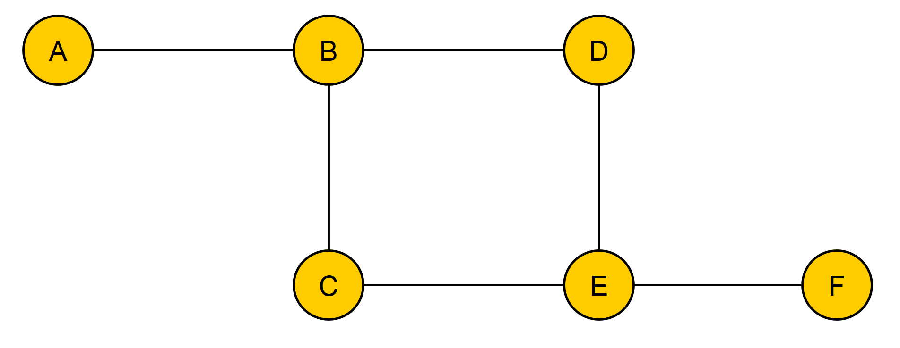
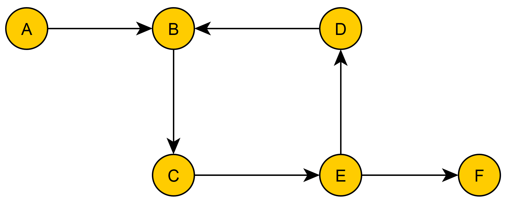

# TD6
##### Auteur : Benoit PEGAZ

## Exercice 1
### 1.
s0: 1  
s1: 3  
s2: 3  
s3: 3  
s4: 2  
s5: 1  
s6: 1  

### 2.
s0: s6  
s1: s2, s3, s5  
s2: s1, s3, s4  
s3: s1, s2, s4  
s4: s2, s3  
s5: s1  
s6: s0

### 3.

## Exercice 2

### 1.

### 2.
