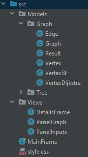

# ALGO - Rendu du projet final
##### Auteur : Benoit PEGAZ
###### tags: `ESGI`, `ALGO`

## Environnement

Ce projet a été développé en [Java 16](https://www.oracle.com/java/technologies/javase/jdk16-archive-downloads.html), en utilisant la bibliothèque graphique [Swing](https://fr.wikipedia.org/wiki/Swing_(Java)) et la bibliothèque de gestion de graphiques [Graphstream](https://graphstream-project.org/)

## Sujet

Présentation du sujet:
- [x] Construire un graphe représentant un réseau de transport existant constitué d’environ 10 à 20 destinations, présentant une structure de type graphe (avec au moins un cycle).
- [x] Créer une interface graphique contenant:
  - La possibilité de choisir un point de départ.
  - La possibilité de choisir un point d’arrivé.
  - L'affichage des itinéraires calculés.
  - L'analyse des calculs des itinéraires calculés.
- [x] L'itinéraire sera calculé via au moins 2 algorithmes différents.
- [x] Comparer les résultats de ces algorithmes:
  - En temps de transport prévu pour l’utilisateur et présenterez la complexité
  - En temps d'exécution qu'ont engendrés ces algorithmes par leur calcul.

## Graphe du réseau de transport

Le graphe utilisé dans l'application est une adaptation du réseau de transport du [Léman Express](https://www.lemanexpress.ch/fileadmin/user_upload/Plans_reseau_et_multimodal/Plan_reseau_Leman_Express_211212_light.pdf)

Le sujet du projet limite le nombre de sommets à 20, le graphe ne contient qu'une partie de l'ensemble des villes desservies et a donc été simplifié.  
Afin de rendre le graphe plus intéressant pour tester l'application, des arêtes ont également été ajoutées.

Le graphe représenté dans l'application:

L'affichage du graphe ainsi que le positionnement de ses sommets se font automatiquement au démarrage de l'application.

> ⚠️ Il est donc possible d'avoir un affichage qui diffère du graphe ci-dessus mais les données qui y sont comprises restent inchangées.

Si les sommets ne sont pas correctement affichés ou se superposent, il est possible de les déplacer en maintenant le clic appuyé.  

Le chemin affiché est le chemin retourné par [l'algorithme de Dijkstra](#algorithme-de-dijkstra).  

## Architecture de l'application

L'application est composée de 2 fenêtres:
- La fenêtre principale, contient:
  - Une zone de saisie des sommets de départ et d'arrivée, et bouton permettant d'accéder à la fenêtre de détails
  - L'affichage du graphe, c'est sur ce graphe que sera également affichée le plus court chemin
- La fenêtre de détails: Fenêtre d'information, c'est dans cette fenêtre que vous pourrez comparer les différents algorithmes implémentés

## Architecture du code
L'ensemble des modèles utilisés dans cette application sont situés dans le package `Models.Graph`. C'est dans ses modèles que sont situés les différents algorithmes implémentés.    

Pour l'interface réalisée avec la librairie Swing, la fenêtre principale `MainFrame` est à la racine du dossier `src`. `MainFrame` est la classe exécutée au lancement de l'application.  
Les autres composants Swing `DetailsFrame`, `PanelGraph` et `PanelInputs` sont situés dans le package `Views`.

## Fonctionnement de l'application

1. Sélectionnez un sommet de départ et de destination dans la fen^tre principale 
2. Si un chemin existe entre ces 2 sommets, il est affiché dans la fen^tre principale  
3. Il est possible d'afficher la fenêtre de détails en cliquant sur le bouton "Détails"  

## Calcul du plus court chemin

### Principe général

Ce projet comporte plusieurs algorithmes **résolvant le problème du plus court chemin**.  
L'idée générale est de trouver un chemin avec un **poids minimal**, c'est-à-dire trouver un chemin d'un sommet à un autre de façon à ce que la somme des arêtes de ce chemin  soit inférieure au poids des autres chemins

Ces algorithmes utilisent la notion de graphe pondéré afin de calculer le plus court chemin, dans notre cas les poids correspondent aux distances (en kilomètres) entre les différents sommets

## Algorithmes implémentés

### Parcours en profondeur modifié

Le parcours en profondeur modifié renvoie un chemin entre deux sommets s'il existe. Cet algorithme ne renvoie pas nécessairement le chemin le plus court.

Cet algorithme exécute un **parcours en profondeur** depuis le sommet de départ, si cet algo parvient à atteindre le sommet de destination il s'arrête pour retourner le chemin inverse trouvé.  
Comme le chemin obtenu n'est pas comparé avec les autres chemins possibles, nous ne pouvons pas affirmer que le chemin obtenu est le plus court chemin.

Cet algorithme a été ajouté à la liste des algorithmes implémentés afin de montrer que trouver un chemin existant a une complexité bien inférieure à trouver le plus court chemin

*Complexité:*  
|V| : le nombre de sommets  
|E| : le nombre d'arêtes  
Coût au pire: O(|V| + |E|)

---

### Algorithme de Dijkstra
L'**algorithme de Dijkstra** est l'algorithme le plus connu résolvant le problème du plus court chemin.  
Cet algorithme fonctionne exclusivement avec un graphe contenant des arêtes de poids positifs.  
Fondé sur un parcours en largeur classiquen, cet algorithme permet de calculer les plus courts chemins d'un sommet de départ vers tous les autres sommets.

A la fin de l'exécution de l'algorithme de Dijkstra, on obtient pour chaque sommet sa distance par rapport au sommet source, et le sommet parent permettant de retrouver le chemin inverse.

De nombreux dérivés de l'algorithme de Dijkstra existent, et d'autres algorithmes se basent dessus tel que l'algorithme A*.

*Complexité:*  
|V| : le nombre de sommets  
|E| : le nombre d'arêtes  
Coût au pire: O(|V| log |V| + |E|)

---

### Algorithme de Bellman-Ford
L'algorithme de Bellman-Ford est également un algorithme permettant de résoudre le problème du plus court chemin.

De la même façon que l'algorithme de Dijkstra, l'algorithme de Bellman-Ford permet de calculer tous les plus courts chemins d'un sommet de départ vers tous les autres sommets.  
Contrairement à l'algorithme de Dijkstra, celui de Bellman-Ford accepte les graphes de poids négatifs (mais sans cycle négatif).

*Complexité:*  
|V| : le nombre de sommets  
|E| : le nombre d'arêtes  
Coût au pire: O(|V||E|)

---

### Autres algorithmes ?

Plusieurs autres algorithmes résolvent le problème du plus court chemin: nous pouvons encore une fois citer l'algorithme A*, très utilisé dans le domaine des jeux vidéos et de l'intelligence artificielle, qui utilise la notion d'heuristique, ou encore l'algorithme de Floyd-Warshall, qui permet de calculer les plus courts chemins pour tous les couples de sommets.

Ce qu'il faut retenir, c'est que chaque algorithme résolvant ce problème est efficace dans un contexte précis.  
C'est ce qui nous permet de choisir dans un cas concret quel algorithme implémenter en fonction de la nature de notre besoin.  